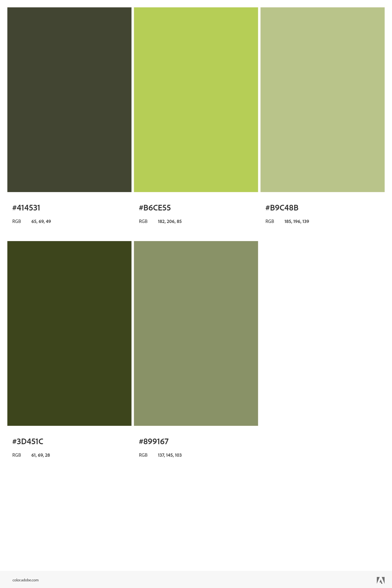
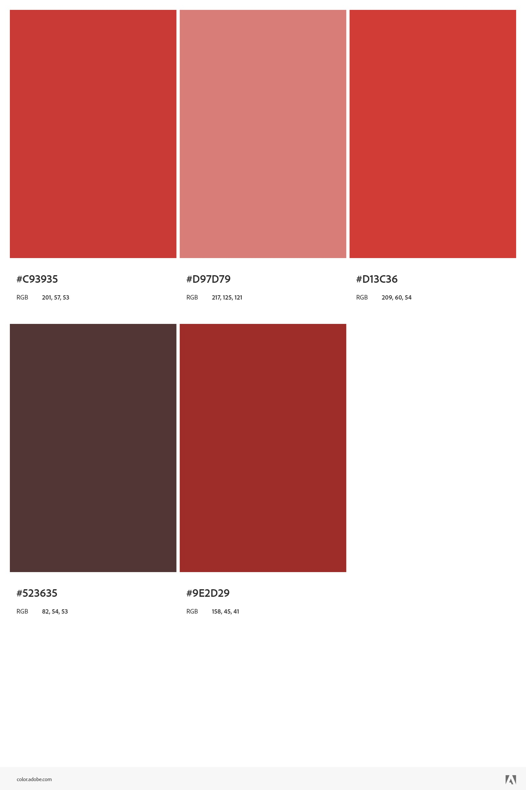
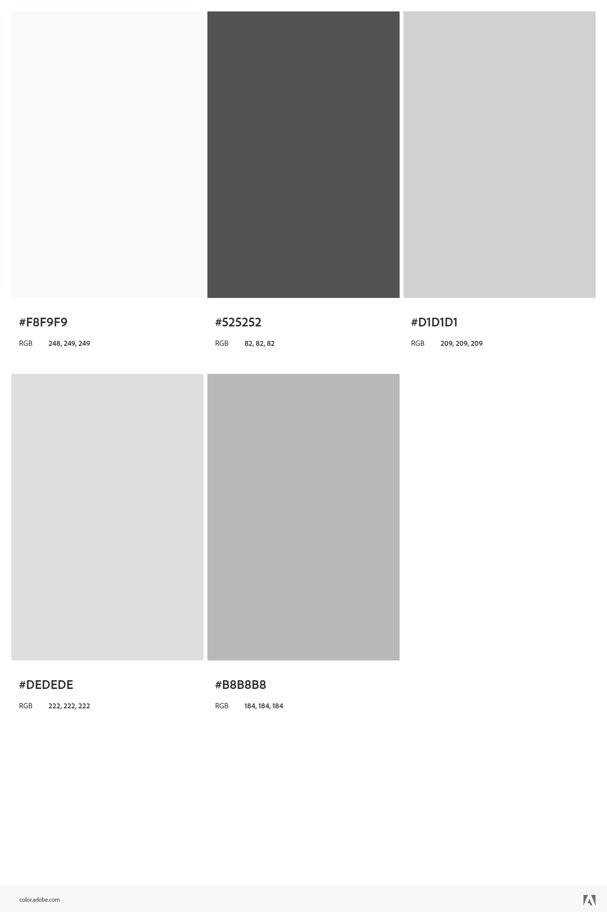
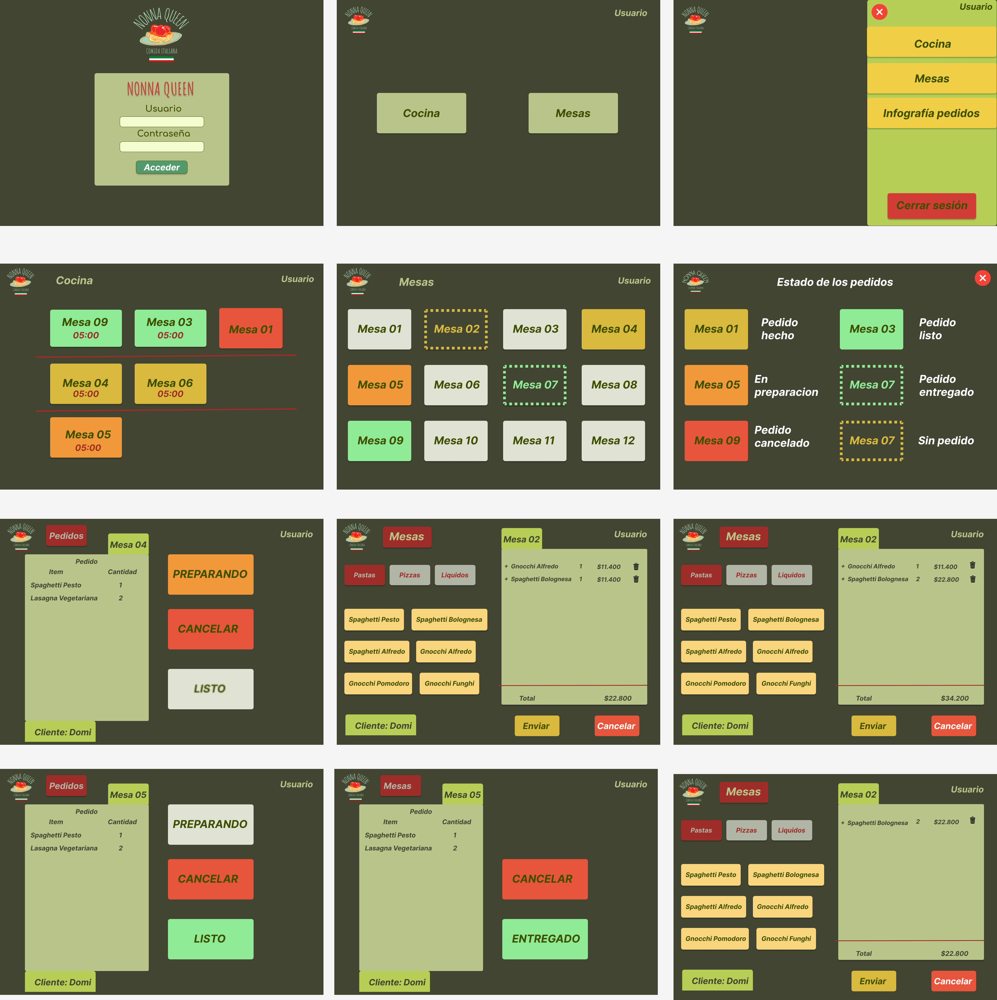

# Burger Queen

## DESCRIPCION
Proyecto para restaurant de comida, en el se aborda la problematica de mantener una comunicacion fluida entre la cocina y los meser@s que atienden, con esto se busca que los usarios (meser@s y cocina) puedan ver en tiempo real el estado de los pedidos para que la entrega de los pedidos sea mas rapida y ordenada. El mesero tomara el pedido por medio de una tablet, el pedido sera enviado a la cocina, ahi podran visualizar el detalle del pedido y actualizar su estado de preparacion, el mesero podra ver esa actualizacion y saber cuando esta listo para servir el pedido. 

## DIAGRAMA DE FLUJO

## PALETA DE COLORES
#### Estados de pedido

#### Gamas app

## PROTOTIPO
Ver flujo [aquí](https://www.figma.com/file/zf6Iatfd72OyGpvaUfgDlk/NONNA-QUEEN?node-id=29%3A108)

## PROCEDIMIENTO
* Crear diagrama de flujo.
* Elegir tema y paleta de colores.
* Comenzar prototipo de alta.
* Instalar Tailwind css.
* Terminar prototipo.
* Instalar empaquetador Vite.
* Instalar dependencias de React Router Dom.
* Crear navbar.
* Crear templates.
* Añadir botones.
* Añadir menu.json
* Crear componente de menu.
* Generar interacción del menu con template order.
* Dividir provider en un componente de carro de compra para reutilizar.
* Conectar con api para crear usuarios y autenticar.
* Agregar conexión con api para mandar y llevar pedido.
